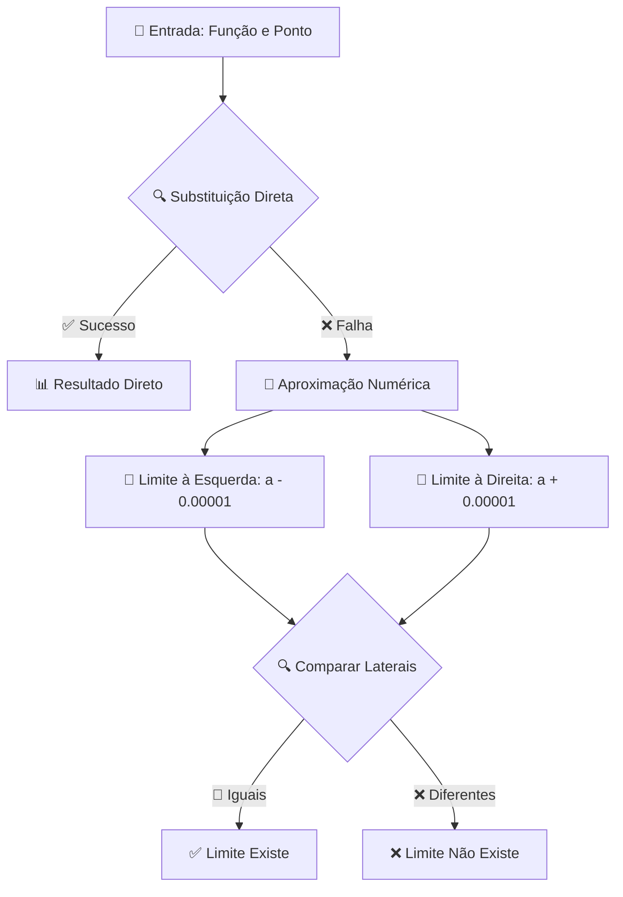

# 🧮 Calculadora de Limites - TADS

<div align="center">


**Uma ferramenta interativa para calcular limites de funções matemáticas**

[🔗 Ver Demonstração](#-como-usar) • [📋 Pré-requisitos](#-pré-requisitos) • [🚀 Instalação](#-instalação) • [📖 Documentação](#-documentação)

</div>

---

## 📖 Sobre o Projeto

Este projeto é uma **calculadora de limites** desenvolvida como atividade acadêmica para o curso de **TADS (Tecnologia em Análise e Desenvolvimento de Sistemas)**. A aplicação permite aos usuários calcular limites de funções matemáticas de forma intuitiva e interativa.

### 🎯 Objetivos
- 📊 Facilitar o aprendizado de cálculo de limites
- 🔍 Implementar algoritmos para análise de limites
- 💻 Desenvolver uma interface web responsiva
- 🧠 Aplicar conceitos matemáticos na programação

---

## ✨ Funcionalidades

### 🔢 Cálculo de Limites
- ✅ **Substituição direta**: Calcula limites por substituição simples
- 🎯 **Aproximação numérica**: Usa métodos de aproximação quando necessário
- ♾️ **Limites infinitos**: Suporte para +∞ e -∞
- 🔄 **Limites laterais**: Detecta diferenças entre limites à esquerda e direita

### 🎨 Interface
- 📱 **Design responsivo**: Funciona em desktop e mobile
- 🎨 **Interface intuitiva**: Fácil de usar para estudantes
- ⚡ **Cálculo em tempo real**: Resultados instantâneos
- 🎯 **Feedback visual**: Resultados destacados e organizados

---

## 🛠️ Tecnologias Utilizadas

<table>
<tr>
<td align="center">

<br><b>HTML5</b>
</td>
<td align="center">

<br><b>CSS3</b>
</td>
<td align="center">

<br><b>JavaScript</b>
</td>
<td align="center">

<br><b>Math.js</b>
</td>
</tr>
</table>

---

## 📋 Pré-requisitos

Antes de começar, você precisa ter instalado:

- 🌐 **Navegador web moderno** (Chrome, Firefox, Safari, Edge)
- 💻 **Servidor local** (opcional, para desenvolvimento)

---

## 🚀 Instalação

### Execução Direta 📂

1. **Clone ou baixe o repositório**
   ```bash
   git clone https://github.com/seu-usuario/calculadora-limites.git
   cd calculadora-limites
   ```

2. **Abra o arquivo**
   - Navegue até a pasta do projeto
   - Clique duas vezes no arquivo `index.html`
   - O navegador abrirá automaticamente

---

## 🎯 Como Usar

### 📝 Passo a Passo

1. **📖 Digite a função**
   ```
   Exemplo: (x^2 - 1)/(x - 1)
   ```

2. **🎯 Defina o ponto**
   ```
   Exemplo: 1, Infinity, -Infinity
   ```


3. **🚀 Clique em "Calcular Limite"**


4. **📊 Veja o resultado**


### 🔍 Exemplos de Uso

#### Exemplo 1: Limite Simples
```
Função: x^2 + 3x + 2
Ponto: 2
Resultado: 12
```

#### Exemplo 2: Limite com Indeterminação
```
Função: (x^2 - 1)/(x - 1)
Ponto: 1
Resultado: 2.0000 (aproximação)
```

#### Exemplo 3: Limite Infinito
```
Função: 1/x
Ponto: Infinity
Resultado: 0
```

---

## 🔧 Como Funciona

### 🧠 Algoritmo de Cálculo



### 📚 Conceitos Matemáticos

- **🔢 Substituição Direta**: `lim f(x) = f(a)`
- **🎯 Aproximação**: `lim f(x) ≈ f(a ± ε)`
- **📏 Limites Laterais**: `lim⁻` e `lim⁺`
- **♾️ Infinito**: Comportamento assintótico

---

## 📁 Estrutura do Projeto

```
📦 calculadora-limites/
├── 📄 index.html          # Arquivo principal
├── 📄 README.md           # Este arquivo
```

---

## 🧪 Testando a Aplicação

### ✅ Casos de Teste

| Função | Ponto | Resultado Esperado |
|--------|-------|-------------------|
| `x^2` | `2` | `4` |
| `(x^2-1)/(x-1)` | `1` | `2` (aproximação) |
| `1/x` | `∞` | `0` |
| `x/0` | `0` | Indeterminação |

### 🐛 Solução de Problemas

| Problema | Solução |
|----------|---------|
| ❌ "Erro: verifique a função" | ✅ Use sintaxe matemática válida |
| ❌ Resultado incorreto | ✅ Verifique se a função está bem definida |
| ❌ Não carrega | ✅ Verifique conexão com internet (Math.js) |

---


## 👥 Contribuição

**Davi Santos** - *Estudante de ADS*


<div align="center">

### ⭐ Se este projeto foi útil, considere dar uma estrela! ⭐


---

**📚 Desenvolvido com ❤️ para a disciplina de Matemática II - TADS**

</div>

